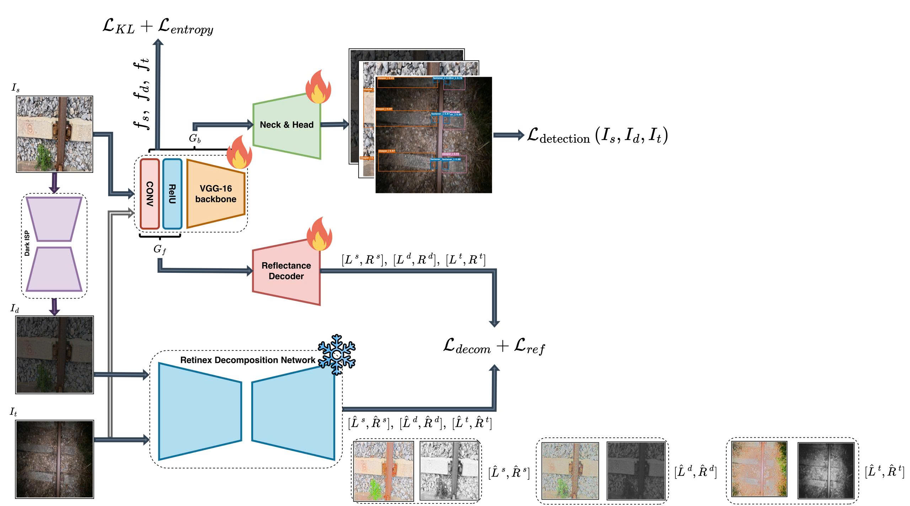

<p align="center">
  <h1 align="center">RAILIGHT: A Robust Illumination-Adaptive Framework for Railway Defect Detection
</h1>
  <p align="center">
    <b>Pham Minh Long</b> — National Yang Ming Chiao Tung University (NYCU), Taiwan
  </p>
</p>



## 🚂 Introduction

Railway defect detectors are trained on well-lit daytime images, but real inspections often run at night. RAILIGHT closes that gap with **unsupervised domain adaptation**: it learns from labelled day images and adapts to **unlabelled** real night frames.

Each training step sees three domains:

| Domain | Data | Labels |
| --- | --- | --- |
| ☀️ Source | well-lit railway images | ✅ |
| 🌗 Synthetic dark | source + Dark-ISP degradation | ✅ (same GT) |
| 🌙 Target | real night video frames | ❌ |

The model is a DSFD-style dual-shot detector with a frozen **Retinex** branch (DAI-Net, CVPR 2024). Reflectance is illumination-invariant, so aligning it across domains makes the detector robust to lighting. Losses include supervised detection, Retinex reconstruction, cross-domain KL alignment, weight anchoring and entropy minimisation.

✨ Highlights:
- 🔌 Swappable backbones: `vgg16`, `vgg16_sppf`, `resnet50/101/152`, `yolo26n/s`
- ⚙️ Everything driven by one YAML config — no code edits per experiment
- 🚀 Multi-GPU training via `torchrun` (DDP)
- 📊 Evaluation on source / target / combined with mAP, confusion matrix, Grad-CAM, t-SNE

## 🛠️ Setup

```bash
conda create -n railight python=3.10 -y
conda activate railight

pip install torch torchvision          # match your CUDA driver
pip install -r requirements.txt        # keep numpy<2
```

Convert YOLO-format data to the RAILIGHT list format:

```bash
python src/utils/convert_yolo_to_railight.py \
    --source-root /path/to/source --out-dir ./dataset \
    --out-prefix source --max-class 3

python src/utils/convert_yolo_to_railight.py \
    --source-root /path/to/target --out-dir ./dataset \
    --out-prefix target --max-class 3
```

This writes `dataset/{source,target}_{train,val,test}.txt`, one line per image with pixel boxes `x y w h cls`.

Pretrained weights go under `weights/`:
- `weights/vgg16_reducedfc.pth` — VGG backbone init
- `weights/decomp.pth` — frozen Retinex DecomNet

## 🚀 Usage

Pick or edit a config, then train:

```bash
python train.py --config configs/train/railight/vgg16/exp1.yaml
```

Multi-GPU (`nproc_per_node` **must** equal the number of GPUs in `gpu_ids`):

```bash
torchrun --standalone --nproc_per_node=2 \
    train.py --config configs/train/railight/vgg16/exp1.yaml
```

Or just use the shell wrappers — they read `gpu_ids` from the config and set `CUDA_VISIBLE_DEVICES` for you:

```bash
bash src/scripts/train.sh
bash src/scripts/test.sh
```

Evaluate a checkpoint:

```bash
python test.py --config configs/test/railight/vgg16/exp1.yaml
```

🔑 Config keys worth knowing:

| Key | Meaning |
| --- | --- |
| `architecture` / `backbone` | `railight` or `dsfd` + backbone name |
| `gpu_ids` | GPUs to use, e.g. `0,1` |
| `kl_loss_weight` | strength of source↔target reflectance alignment |
| `target_loss_weight` | unsupervised Retinex loss on night frames |
| `is_use_rc_loss` | redecomposition cohering loss on/off |
| `focal_enabled` | focal loss for class imbalance |
| `use_wandb` | log to Weights & Biases |

⚡ Throughput / memory switches — each falls back to the old behaviour when off:

| Key | Default | Meaning |
| --- | --- | --- |
| `amp` | `false` | `off` / `fp16` / `bf16`. Half-precision activations, fp32 losses. Roughly halves the memory of every forward pass in a step, so the device batch goes up (measured at 640×640 on a 24 GB card: 4 → 6) and a step runs ~1.4× faster. |
| `match_on_device` | `true` | Build the SSD match targets on the GPU instead of assembling them on the CPU and copying back once per image. Bit-identical loss, ~7× faster matching. |
| `loader_persistent_workers` | `true` | Keep DataLoader workers alive across epochs. |
| `loader_prefetch_factor` | `4` | Batches each worker runs ahead of the GPU. |
| `profile` | `false` | Per-stage timings. Costs one `torch.cuda.synchronize()` per stage (~15 per iteration), so leave it off unless you are measuring. `RAILIGHT_PROFILE=1` overrides it for a one-off run. |
| `vgg_fixed_layers` | `0` | Freeze the first N entries of the VGG feature list — `fcos.pytorch`'s `MODEL.VGG.FIXED_LAYERS`, which uses 10 (conv1_1 through the second max-pool). Both repos build the list with the same `vgg()` routine, so the index means the same thing. Frozen layers stop retaining activations, so this cuts memory sharply as well. Pair it with `augmentation: fcos`: FCOS gets away with flip-only augmentation *because* its backbone prefix is frozen. |
| `drop_last_train` | `true` | Drop the uneven tail of each training epoch. The target loader already does; keeping the source loader's partial batch means the last batch of an epoch is `len(dataset) % batch_size`, which no longer pairs 1:1 with the target batch the alignment and DAMamba losses match it against — a shape error ~1 epoch into training. Dropped images are reshuffled back next epoch. |
| `loss_preset` | `full` | `detection_only` zeroes every domain-adaptation term (`kl`, `entropy`, `target`, `wreg`, `align_adv`, `da_*`) and turns off supervised target labels, leaving the two detection heads and the Retinex reconstruction. Use it to measure the detector's own ceiling before attributing anything to the DA losses. |
| `anchor_sizes1` / `anchor_sizes2` / `aspect_ratio` | `null` | Override the anchor bank (inherited from DSFD/WIDER-FACE). Check coverage first with `python -m utils.anchor_stats` — see below. |
| `augmentation` | `railight` | `railight` = colour jitter + random crop + mosaic + scale jitter + the offline strong-augmented bank. `fcos` = horizontal flip only, which is all `fcos.pytorch` uses. Setting `fcos` also makes the letterbox padding deterministic and ignores `offline_aug_dir`. |
| `dataset_format` | `railight` | `railight` = the `.txt` list format. `voc` = a Pascal VOC directory (`<root>/VOC2007/{Annotations,JPEGImages,ImageSets/Main,classes.txt}`) — the same layout `fcos.pytorch/datasets/railway*` points at, so both codebases can read the same files. With `voc`, set `source_root` / `target_root` and the `*_split` keys instead of the `*_file` keys. |
| `data_pipeline` | `transforms` | `transforms` = the composable `(image, target)` pipeline in `src/data/transforms.py`, assembled once by `build_transforms()` and printed at startup. `legacy` = the old monolithic `utils.augmentations.preprocess()`. Bit-identical outputs, except that validation no longer picks a random resize filter per image. |
| `target_use_transforms` | `true` | Send unlabelled target images through the same val pipeline as the source images. Off reproduces the old behaviour, where target frames were squashed to a square (source frames were letterboxed) and reached the network as BGR (source frames as RGB). |
| `overlap_thresh` | `null` | Positive-anchor IoU threshold. `null` keeps the inherited WIDER-FACE value of 0.35; 0.5 is the usual object-detection choice. |
| `nominal_batch_size` | `0` | Effective batch via gradient accumulation, e.g. `batch_size: 6` + `nominal_batch_size: 16`. |
| `model_selection` | `micro_f1` | `micro_f1` / `macro_f1` / `macro_best_f1` / `macro_map`. `macro_best_f1` scores each class at its own best point on the P/R curve — the comparable number when another detector reports P/R/F1 at its best-F1 operating point rather than at a fixed confidence. |

`configs/train/railight/vgg16/exp6.yaml` is exp5 with all of these turned on.

🎯 Before touching the anchors, measure whether they are actually the problem:

```bash
python -m utils.anchor_stats --list-file dataset/source_train.txt --input-size 640 --letterbox
python -m utils.anchor_stats --voc-root /path/to/source_faster_rcnn --split train --letterbox
```

It reports the best IoU each ground-truth box can reach against the whole prior
bank. Boxes below `overlap_thresh` never get a positive sample and are
unlearnable however long you train, so that percentage is a hard recall ceiling.
It also prints k-means aspect ratios you can paste into `aspect_ratio:`.

📦 Outputs:
- `weights/<arch>/<backbone>/<exp>/best_model.pth`, `last_model.pth`
- `charts/<mode>/<arch>/<backbone>/<exp>/` — `confusion_matrix_*.png`, `samples_day.png`, `samples_real_night.png`, `tsne_reflectance.png`
- `records/` — per-iteration JSONL logs
- `metrics.json` — mAP@0.5, mAP@0.5:0.95, P/R/F1, FPS and params, split into `combined` / `source` / `target`

## 🎯 Conclusion

RAILIGHT shows that a railway defect detector can be trained with day labels only and still work at night 🌙. Synthetic Dark-ISP images provide supervision under night statistics, and reflectance alignment bridges the remaining gap to real footage — no target annotations needed.

🙏 Built on DAI-Net (Du et al., CVPR 2024), DSFD, Ultralytics YOLO, and the model-adaptation regularisers of Li et al., CVPR 2020.
