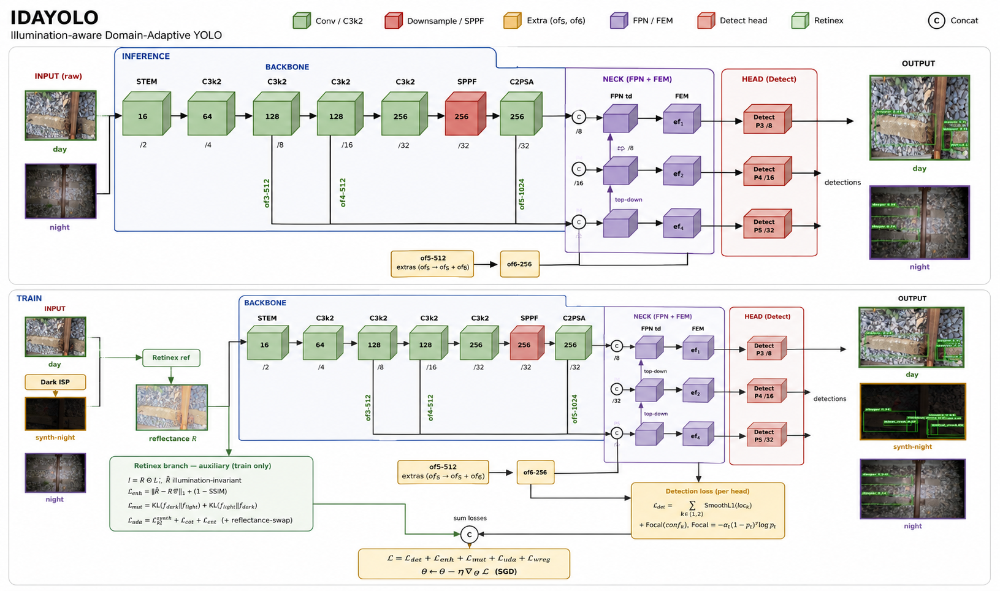

<p align="center">
  <h1 align="center">DAI-Net — Low-Light Object Detection with Day→Night UDA</h1>
  <p align="center">
    <b>Pham Minh Long</b> — National Yang Ming Chiao Tung University (NYCU), Taiwan
  </p>
</p>

Low-light object detection with **unsupervised domain adaptation (UDA)** from a
labelled well-lit *source* domain to an unlabelled real *night* *target*
domain. Built on DAI-Net (CVPR 2024, [arXiv:2312.01220](https://arxiv.org/abs/2312.01220)),
extended to arbitrary YOLO-format datasets, real video target frames, and
explicit UDA / model-adaptation objectives.



---

## 1. Model

### 1.1 Detector — DSFD / DAI-Net (`src/models/dai_net.py`)

| Block | Role |
|---|---|
| **VGG-16 backbone** (`vgg`) | shared feature extractor (conv1 → fc7), pretrained `vgg16_reducedfc.pth` |
| **Reflectance branch** (`ref`) | small decoder on conv4_3 features → 3-ch Retinex **reflectance** R; the only "enhancement" head trained end-to-end |
| **Extra layers + FPN top-down + FEM** | multi-scale feature pyramid + receptive-field enrichment |
| **PAL1 head** (`loc_pal1`,`conf_pal1`) | first-shot anchors on backbone features |
| **PAL2 head** (`loc_pal2`,`conf_pal2`) | refined anchors on FEM features (the head used for eval/mAP) |
| **PriorBox / Detect** | anchor generation + decode + internal NMS |

`forward(x, x_light, I, I_light)` runs **two streams** through the shared VGG,
decomposes reflectance for both, performs an illumination/reflectance
**interchange + redecomposition**, and emits PAL1/PAL2 detections plus the
feature **mutual-KL** term.

### 1.2 Retinex DecomNet — `RetinexNet` (`src/models/enhancer.py`)

Frozen (`eval()`, not in the optimizer) decomposer loaded from `decomp.pth`.
Given an image it returns `(R, I)` — reflectance and illumination — used as
**pseudo-ground-truth** for the enhancement losses. Because it is frozen, any
loss that only depends on its output carries **no trainable gradient** (see
§3, `target_unsup` note).

### 1.3 Alternative detector — YOLO26 (`src/models/yolo/`, vendored Ultralytics)

Selected automatically when the YAML has `architecture: yolo…`; trained by
`src/models/dainet/yolo_runner.py` through the same `python train.py --config`
entrypoint.

---

## 2. Training techniques

### 2.1 Three data domains per iteration

| Symbol | Source | Labels | Purpose |
|---|---|---|---|
| `source_images` | well-lit dataset | ✅ bbox GT | supervised signal |
| `source_dark` | `source` ⊕ **Dark-ISP** (`utils/dark_isp.py`) | ✅ (same GT, paired) | paper-faithful synthetic night |
| `target_images` | real night video frames | ❌ | bridge synthetic→real gap |

Dark-ISP (`Low_Illumination_Degrading`) applies a physically-motivated
low-light camera pipeline (low-light corruption + noise + ISP) so the
synthetic dark image **keeps the source GT** — enabling *supervised*
detection under night statistics.

### 2.2 Detection on the dark stream (paper-faithful)

`net(source_dark, source_images, I_source_dark, I_source)` →
detection is supervised on the **dark** prediction against **source GT**
(paired), while the clean stream drives reflectance consistency.

### 2.3 Mutual learning

Inside `forward`, features of the dark and clean streams (and their
illumination/reflectance-swapped redecompositions) are aligned with a
symmetric **KL** (`mutual`) — encourages illumination-invariant features.

### 2.4 Unsupervised Domain Adaptation (source ↔ real target)

`net.extract_features(source, target, I_s, I_t)` pools backbone features of
both domains and aligns them with a cross-domain **KL** (`kl_st`). Pushes the
backbone toward a **domain-invariant** representation using *unlabelled*
target data.

### 2.5 Model-adaptation regularisers (3C-GAN, Li et al. CVPR 2020)

* **ℓ_wReg** — anchors the VGG backbone to its pretrained source weights
  (`‖θ_vgg − θ_vgg^src‖²`); curbs over-fitting / preserves source knowledge.
* **ℓ_ent** — entropy-minimisation on the target detection confidence;
  drives decision boundaries out of dense target regions (sharper, more
  confident night predictions).

### 2.6 Post-processing — NMS (`src/utils/nms.py`)

`multiclass_nms` (greedy, **per-class**, IoU 0.45) is applied to decoded
predictions before metrics/visualisation, removing redundant overlapping
boxes the detector still emits after its internal Detect layer.

### 2.7 Schedule & robustness

* SGD, step LR (`lr_steps`), grad-clip ‖g‖≤35, DDP multi-GPU.
* Infinite random target sampler (replacement) → never starves.
* **Resume-safe history**: on `resume`, past curves are restored from
  `history.json` and, as an append-only fallback, from
  `records/<exp>_{train,val}.csv` — charts continue instead of restarting.

---

## 3. Loss functions

Total objective (every term summed; weight `0` disables it):

```
L =  L_pal1_loc + L_pal1_conf            # PAL1 detection (MultiBox)
   + L_pal2_loc + L_pal2_conf            # PAL2 detection (MultiBox)
   + L_enhance                           # Retinex reconstruction  (×0.1)
   + L_enhance2                          # reflectance/illum consistency
   + L_mutual            (source ↔ source_dark KL,  internal)
   + L_kl_st             (source ↔ target  KL,  × kl_loss_weight)
   + L_target_unsup      (real-target Retinex, × target_loss_weight)
   + L_wreg              (VGG anchor,        × wreg_loss_weight)
   + L_entropy           (target entropy-min,× entropy_loss_weight)
```

| Term | Definition | Intuition |
|---|---|---|
| **L_pal*_loc / conf** | `MultiBoxLoss` (`layers/modules`): Smooth-L1 on matched anchors + softmax CE with hard-negative mining | standard SSD/DSFD detection on the **dark** stream vs **source GT** |
| **L_enhance** | `EnhanceLoss` (`enhance_loss.py`): MSE + (1−SSIM) reconstruction of `R·I` vs image, for clean & dark, + illumination-smoothness; scaled `×0.1` | Retinex decomposition must reconstruct the input |
| **L_enhance2** | L1 + (1−SSIM) between the detector's reflectance and the frozen DecomNet reflectance (clean & dark) | distils the frozen Retinex prior into the trainable `ref` branch |
| **L_mutual** | symmetric `KL` of pooled features: source ↔ source_dark (+ swapped redecomp.) | illumination-invariant backbone (paper) |
| **L_kl_st** | symmetric `KL` of pooled backbone features: source ↔ **target** | **UDA** — domain-invariant features from unlabelled night |
| **L_target_unsup** | `MSE + (1−SSIM) + smooth` of `R_t · I_t` vs target, where **R_t comes from the trainable `ref` branch** and `I_t` from the frozen DecomNet (detached) | unsupervised Retinex on **real** night. ⚠️ Earlier it used R/I both from the frozen DecomNet → no trainable parameter → loss could not decrease; now routed through the trainable branch |
| **L_wreg** | mean `‖θ_vgg − θ_vgg^pretrained‖²` | keep adapted model near source (anti-overfit) |
| **L_entropy** | `−Σ p·log p` over target PAL2 class posteriors | confident, well-separated target predictions |

Weights live in `data/config.py` (`cfg.WEIGHT.*`) and the experiment YAML
(`kl_loss_weight`, `target_loss_weight`, `wreg_loss_weight`,
`entropy_loss_weight`).

---

## 4. Project layout

```
train.py / test.py          # unified entrypoints (dispatch by architecture)
configs/                    # YAML experiments
src/
  data/      source_domain / target_domain / datamodule / meta / config
  utils/     augmentations · dark_isp · visualize · nms · convert/cut tools
  scripts/   *.sh launchers (cd to repo root automatically)
  models/    dai_net · dsfd_* · enhancer · factory
    layers/  multibox / enhance losses, bbox utils, priorbox
    yolo/    vendored Ultralytics (YOLO26)
    dainet/  config (Builder) · constants · yolo_runner
```

`train.py`/`test.py` prepend `src/` and `src/models/` to `sys.path` so all
absolute imports resolve without per-file hacks.

---

## 5. Quick start

```bash
conda activate dainet
pip install -r requirements.txt          # torch (numpy<2!), sklearn, …

# DAI-Net
python train.py --config configs/train/dai_net/vgg16/exp1.yaml
# YOLO26 (architecture: yolo… in the YAML)
python train.py --config configs/train/yolo/csp/exp1.yaml
# evaluate
python test.py  --config configs/test/dai_net/vgg16/exp1.yaml
```

Multi-GPU: `torchrun --nproc_per_node=N train.py --config …`.

---

## 6. Metrics & visualisation

`charts/<mode>/<arch>/<backbone>/<exp>/`:

* `losses.png` — per-iter loss-function panels (raw + EMA trend) **and**
  train-vs-val overlay panels for Loss/Precision/Recall/F1/mAP (spot
  over-fitting at a glance)
* `confusion_matrix.png`, `pr_curve.png`, `recall_f1.png` —
  precision/recall/F1 & AP via **scikit-learn**
* `tsne_source_features.png` — source embeddings (full val set) by GT class
* `gradcam_source_vs_target.png`, `domain_metrics.png` (KL & entropy vs epoch)
* `samples_{day,synth_night,real_night}.png`

Validation prints a sectioned box table (Loss / Detection val / Detection
train-subset / Domain / Timing). CSV: `records/<arch>/<backbone>/<exp>_*.csv`.

---

## 7. Acknowledgements

DAI-Net (Du et al., CVPR 2024) · DSFD · Ultralytics YOLO · model-adaptation
regularisers after *"Model Adaptation: UDA without Source Data"* (Li et al.,
CVPR 2020).
